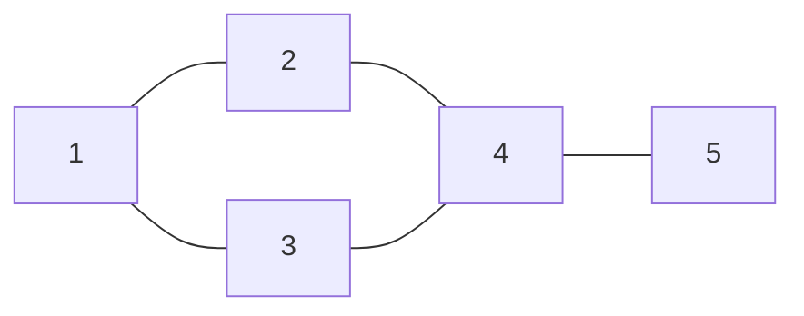

# BFS Deep Dive: The Wave Traversal 🌊🏹

Bhai, dhyan se is breakdown ko dekho. Ye tumhare dimaag mein BFS ko hamesha ke liye set kar dega.

### 🎨 The Graph Structure


---

### 🔬 Step-by-Step Dry Run (Start from Node 1)

| Step | Queue (Basket) | Visited Array | BFS Result (Output) | Action |
| :--- | :--- | :--- | :--- | :--- |
| **0** | `[1]` | `{1}` | `[]` | Node 1 se shuru kiya. Mark Visited. |
| **1** | `[2, 3]` | `{1, 2, 3}` | `[1]` | 1 nikala. Uske padosi (2,3) ko Queue mein dala. |
| **2** | `[3, 4]` | `{1, 2, 3, 4}` | `[1, 2]` | 2 nikala. Padosi 4 ko dala. |
| **3** | `[4]` | `{1, 2, 3, 4}` | `[1, 2, 3]` | 3 nikala. Padosi 4 pehle se **Visited** hai! SKIP! 🛑 |
| **4** | `[5]` | `{1, 2, 3, 4, 5}` | `[1, 2, 3, 4]` | 4 nikala. Padosi 5 ko dala. |
| **5** | `[]` | `{1, 2, 3, 4, 5}` | `[1, 2, 3, 4, 5]` | 5 nikala. No new neighbors. FINISH! ✅ |

---

### 🛡️ Disconnected Components (The Pro Tip) ⚔️🌋
Bhai, agar graph ke do hisse aapas mein connected nahi hain, toh humein har node pe ja kar check karna padta hai:
```javascript
for (let i = 0; i < V; i++) {
    if (!visited[i]) {
        bfs(i, adj, visited); // Nayi wave shuru karo! 🌊
    }
}
```
Isse poora graph (saare tukde) cover ho jata hai! 🎯🏎️💨⚡


---

### 🛡️ The Titan Rules (Asal Sach):

1.  **Queue:** Ye decide karti hai ki "Agla kaun?" 🧺
2.  **Visited:** Ye "Pehredaar" (Guard) hai. Bina iske, tum Infinity Loop mein mar jaoge. 🛡️
3.  **Order:** BFS hamesha **Shortest Path (in terms of edges)** dhoondhta hai. 🏎️💨

---

### 📝 Logic Sync Challenge:
Bhai, agar main node `1` se BFS chalu karu, toh kya Node `5` (jiske liye 3 edges cross karni hain) kabhi Node `2` (jo sirf 1 edge door hai) se pehle aa sakta hai? 🏁🏹
